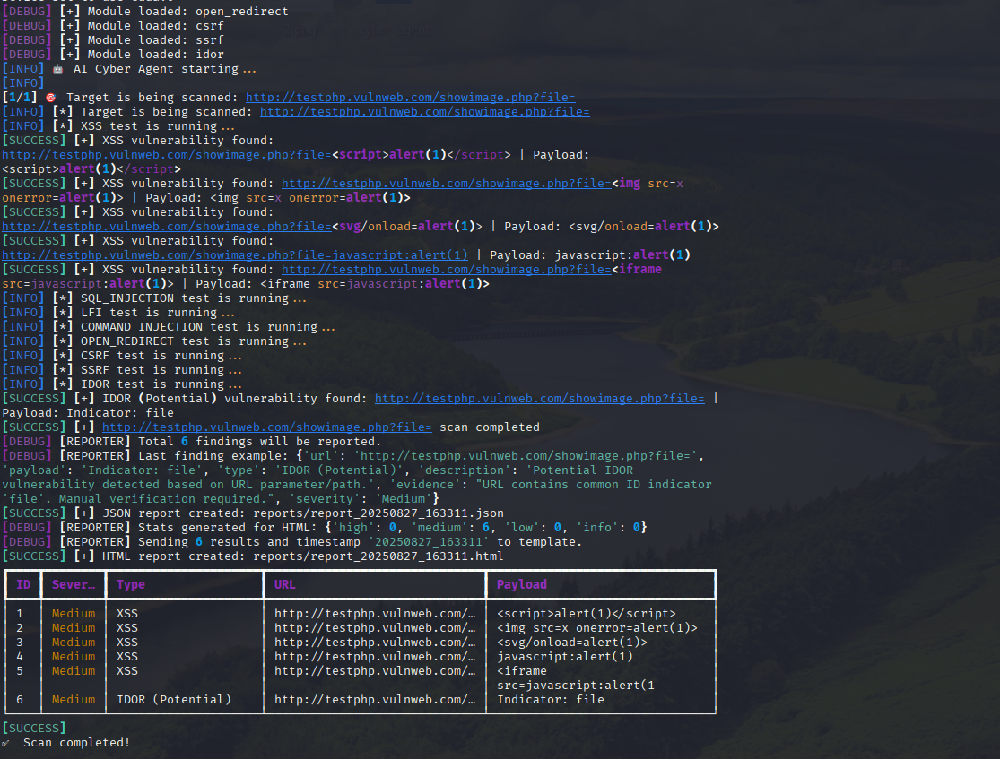
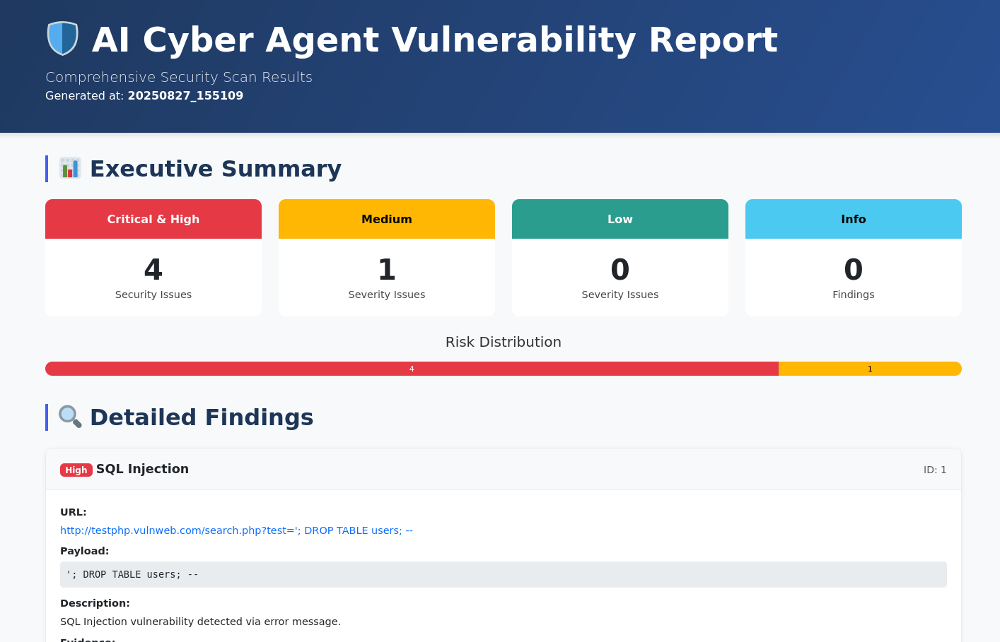
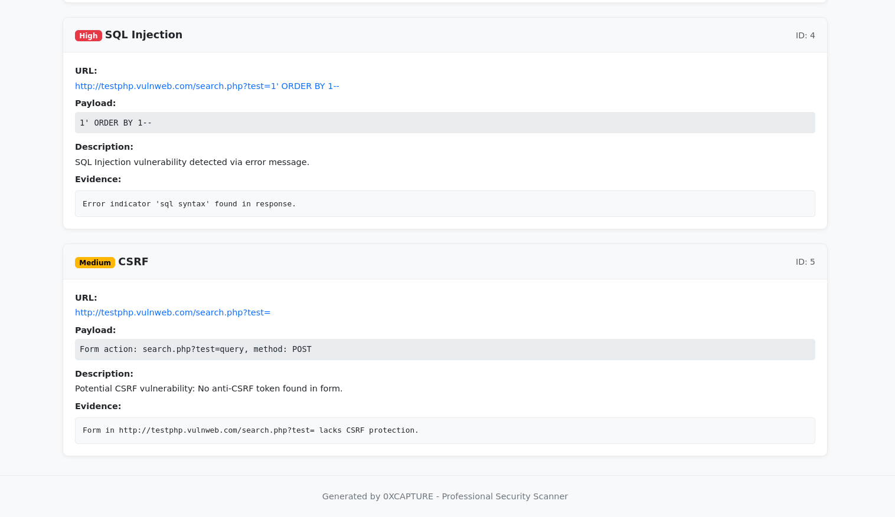

# 🛡️ AI Cyber Agent - Professional Red Team & Bug Bounty Tool

[](https://opensource.org/licenses/MIT)
[](https://www.python.org/downloads/)
[](http://makeapullrequest.com)

**AI Cyber Agent** is an advanced, AI-powered cyber security scanner designed for red team operations and bug bounty hunting. It features modular architecture, dynamic payload generation, and comprehensive reporting.

## 🌟 Key Features

- **🤖 AI/ML Integration:**
  - Dynamic, context-aware payload generation using `distilgpt2`.
  - WAF/IDS bypass through intelligent obfuscation.
  - Extensible for future custom security models (e.g., `Llama-Guard`).

- **🔍 Comprehensive Vulnerability Scanning:**
  - XSS (Cross-Site Scripting)
  - SQLi (SQL Injection)
  - LFI (Local File Inclusion)
  - Command Injection
  - Open Redirect
  - CSRF (Cross-Site Request Forgery)
  - SSRF (Server-Side Request Forgery) *(Basic)*
  - IDOR (Insecure Direct Object References) *(Basic)*

- **📈 Advanced Reporting:**
  - **JSON:** Structured, machine-readable output.
  - **HTML:** Interactive, colorful reports with Bootstrap.
  - **Console:** Rich, colored output using the `rich` library.

- **🖥️ Dual Interface Support:**
  - **CLI (Command Line Interface):** Ideal for quick scans and automation.
  - **GUI (Graphical User Interface):** User-friendly with visual feedback.

- **⚙️ Professional Configuration:**
  - Proxy support (e.g., integration with Burp Suite).
  - Stealth mode for less detectable scanning.
  - Rate limiting and delay settings.
  - Modular design: Easily add new vulnerability modules.

## 📸 Screenshots

### CLI Interface

*Example of CLI output showing scan progress and findings.*

### HTML Report - Executive Summary

*Executive summary section of the HTML report with risk statistics.*

### HTML Report - Detailed Findings

*Detailed findings section of the HTML report.*

## 📦 Installation

### Requirements

- Python 3.8 or higher
- `pip` package manager

### Step-by-Step Setup

1.  **Clone the Repository:**
    ```bash
    git clone https://github.com/capture0x/ai-cyber-agent.git
    cd ai-cyber-agent
    ```

2.  **Create a Virtual Environment (Recommended):**
    ```bash
    python -m venv venv
    # Linux/macOS:
    source venv/bin/activate
    # Windows:
    venv\Scripts\activate
    ```

3.  **Install Dependencies:**
    ```bash
    # Core dependencies
    pip install -r requirements.txt

    # For GUI (if needed)
    pip install -r gui/requirements-gui.txt
    ```

## 🚀 Usage

### CLI (Command Line Interface)

The CLI is perfect for quick scans and automation.

```bash
# Scan a single target
python -m cli.cli_app -t http://example.com/page?id=

# Scan multiple targets
python -m cli.cli_app -t http://example.com/page1?id= http://example.com/page2?user=

# Load targets from a file
python -m cli.cli_app -f examples/targets.txt

# Scan with proxy (e.g., Burp Suite) and stealth mode
python -m cli.cli_app -f examples/targets.txt --proxy http://127.0.0.1:8080 --stealth

# Scan with a custom delay between requests
python -m cli.cli_app -f examples/targets.txt --delay 2.5
