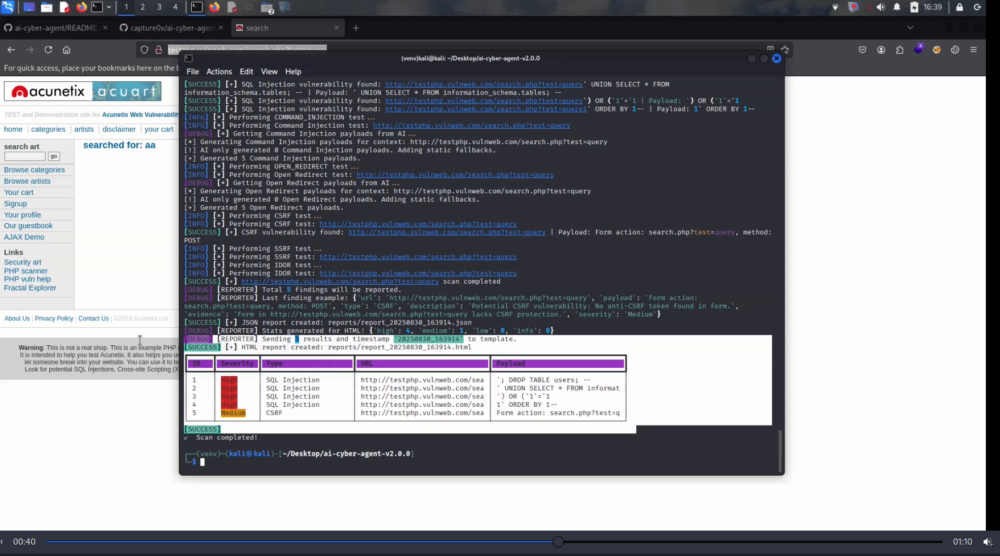

# 🛡️ AI Cyber Agent v2.0.0 - Professional Red Team & Bug Bounty Tool

[](https://opensource.org/licenses/MIT)
[](https://www.python.org/downloads/)
[](http://makeapullrequest.com)
[](https://huggingface.co/distilgpt2)
[](https://github.com/capture0x/ai-cyber-agent/releases)

**AI Cyber Agent** is an advanced, AI-powered cyber security scanner designed for red team operations and bug bounty hunting. It features modular architecture, dynamic payload generation, and comprehensive reporting.

## 🌟 Key Features

- **🤖 AI/ML Integration:**
  - **Dynamic Payload Generation:** Uses `distilgpt2` (via Hugging Face `transformers`) to generate context-aware payloads for XSS, SQLi, LFI, Command Injection, Open Redirect.
  - **WAF/IDS Bypass:** Applies intelligent obfuscation and encoding techniques (URL encoding, HTML entity encoding, case mixing, comment insertion, etc.) to payloads generated by AI or statically.
  - **Target Analysis:** Analyzes target technology stack (server, language, framework, CMS) to prioritize relevant vulnerability modules.
  - **Anomaly Detection:** Monitors response times, sizes, status codes, and content for statistical anomalies that might indicate subtle vulnerabilities or side-effects of injections.
  - **Extensible Design:** Built with a modular structure, easily integrable with future custom security models (e.g., `Llama-Guard`, `CyberSecEval`).

- **🔍 Comprehensive Vulnerability Scanning:**
  - **XSS (Cross-Site Scripting):** Tests for reflected XSS using dynamic payloads and WAF bypass techniques.
  - **SQLi (SQL Injection):** Tests for error-based SQL injection using dynamic payloads and WAF bypass techniques.
  - **LFI (Local File Inclusion):** Tests for local file inclusion vulnerabilities using dynamic payloads and WAF bypass techniques.
  - **Command Injection:** Tests for command execution vulnerabilities using dynamic payloads and WAF bypass techniques.
  - **Open Redirect:** Tests for open redirect vulnerabilities using dynamic payloads and WAF bypass techniques.
  - **CSRF (Cross-Site Request Forgery):** Checks for missing anti-CSRF tokens in forms.
  - **SSRF (Server-Side Request Forgery) *(Basic)*:** Performs basic checks for SSRF based on parameter names.
  - **IDOR (Insecure Direct Object References) *(Basic)*:** Performs basic checks for IDOR based on URL parameter/path names.

- **📈 Advanced Reporting:**
  - **JSON:** Structured, machine-readable output.
  - **HTML:** Interactive, colorful reports with Bootstrap, including executive summary with risk statistics and detailed findings.
  - **Console:** Rich, colored output using the `rich` library with structured tables and panels.

- **🖥️ Dual Interface Support:**
  - **CLI (Command Line Interface):** Ideal for quick scans and automation.
  - **GUI (Graphical User Interface):** User-friendly with visual feedback, powered by PyQt5.

- **⚙️ Professional Configuration:**
  - **Proxy Support:** Seamless integration with tools like Burp Suite for interception and analysis.
  - **Stealth Mode:** Configurable delays and request throttling for less detectable scanning.
  - **Rate Limiting:** Built-in delay settings to respect target server resources.
  - **Modular Design:** Easily add new vulnerability modules.

## 📸 Screenshots

### CLI Interface

*Example of CLI output showing scan progress and findings.*

### HTML Report - Executive Summary

*Executive summary section of the HTML report with risk statistics.*

### HTML Report - Detailed Findings

*Detailed findings section of the HTML report.*

## 📸 YouTube Video

[](https://youtu.be/mtRktmjb3O8)

*Click on the image above to watch the full demo video on YouTube.*

## 📦 Installation

### Requirements

- Python 3.8 or higher
- `pip` package manager

### Option 1: Install from GitHub Releases (Recommended for Users)

1.  **Download the Latest Release:**
    *   Go to the [GitHub Releases page](https://github.com/capture0x/ai-cyber-agent/releases).
    *   Download the latest `ai-cyber-agent-v2.0.0` file.

2.  **Extract the Archive:**
    *   Extract the downloaded ZIP file to a directory of your choice.
    *   ```bash
        unzip ai-cyber-agent-v2.0.0.zip
        cd ai-cyber-agent-v2.0.0
        ```

3.  **Create a Virtual Environment (Recommended):**
    ```bash
    python -m venv venv
    # Linux/macOS:
    source venv/bin/activate
    # Windows:
    venv\Scripts\activate
    ```

4.  **Install Dependencies:**
    ```bash
    # Core dependencies
    pip install -r requirements.txt

    # For GUI (if needed)
    pip install -r gui/requirements-gui.txt
    ```

## 🚀 Usage

### CLI (Command Line Interface)

The CLI is perfect for quick scans and automation.

```bash
# Scan a single target
python -m cli.cli_app -t http://example.com/page?id=

# Scan multiple targets
python -m cli.cli_app -t http://example.com/page1?id= http://example.com/page2?user=

# Load targets from a file
python -m cli.cli_app -f examples/targets.txt

# Scan with proxy (e.g., Burp Suite) and stealth mode
python -m cli.cli_app -f examples/targets.txt --proxy http://127.0.0.1:8080 --stealth

# Scan with a custom delay between requests
python -m cli.cli_app -f examples/targets.txt --delay 2.5
```

### GUI (Graphical User Interface)

The GUI offers a user-friendly experience.

```bash
python -m gui.gui_app
```

GUI Features:
- Add targets manually or load from a file.
- Configure proxy, stealth mode, and delay.
- Real-time scan output.
- View interactive HTML reports.

## ⚠️ Disclaimer

This tool is intended for **authorized security testing** and **educational purposes only**. Unauthorized scanning of systems is illegal. The user assumes all responsibility for its use.

## 📄 License

This project is licensed under the MIT License. See the [LICENSE](https://raw.githubusercontent.com/capture0x/ai-cyber-agent/refs/heads/main/LICENSE) file for details.

## 📬 Contact

For questions, suggestions, or feedback, please open an issue or contact `info@oxcapture.com`.
